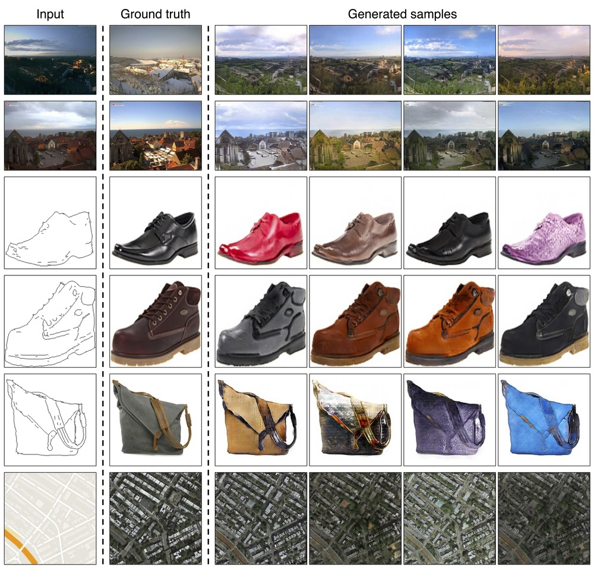

<br><br><br><br>

# BicycleGAN
[[Project Page]](https://junyanz.github.io/BicycleGAN/) [[Paper]](https://arxiv.org/abs/1711.11586) [[Demo Video]](https://youtu.be/JvGysD2EFhw)


Pytorch implementation for multimodal image-to-image translation. For example,  given the same night image, our model is able to synthesize possible day images with different types of lighting, sky and clouds. The training requires paired data.

  

**Toward Multimodal Image-to-Image Translation.**  
[Jun-Yan Zhu](https://people.eecs.berkeley.edu/~junyanz/),
 [Richard Zhang](https://richzhang.github.io/), [Deepak Pathak](http://people.eecs.berkeley.edu/~pathak/), [Trevor Darrell](https://people.eecs.berkeley.edu/~trevor/), [Alexei A. Efros](https://people.eecs.berkeley.edu/~efros/), [Oliver Wang](http://www.oliverwang.info/), [Eli Shechtman](https://research.adobe.com/person/eli-shechtman/).  
 UC Berkeley and Adobe Research  
In NIPS, 2017.

## Example results
  


## Prerequisites
- Linux or macOS
- Python 2 or 3
- CPU or NVIDIA GPU + CUDA CuDNN


## Getting Started ###
### Installation
- Clone this repo:
```bash
git clone -b master --single-branch https://github.com/junyanz/BicycleGAN.git
cd BicycleGAN
```
- Install PyTorch and dependencies from http://pytorch.org
- Install python libraries [visdom](https://github.com/facebookresearch/visdom), [dominate](https://github.com/Knio/dominate), and [moviepy](https://github.com/Zulko/moviepy).   

For pip users:
```bash
bash ./scripts/install_pip.sh
```

For conda users:
```bash
bash ./scripts/install_conda.sh
```


### Use a Pre-trained Model
- Download some test photos (e.g., edges2shoes):
```bash
bash ./datasets/download_testset.sh edges2shoes
```
- Download a pre-trained model (e.g., edges2shoes):
```bash
bash ./pretrained_models/download_model.sh edges2shoes
```

- Generate results with the model
```bash
bash ./scripts/test_shoes.sh
```
The test results will be saved to a html file here: `./results/edges2shoes/val/index.html`.

- Generate results with synchronized latent vectors
```bash
bash ./scripts/test_shoes.sh --sync
```
Results can be found at `./results/edges2shoes/val_sync/index.html`.

### Generate Morphing Videos
- We can also produce a morphing video similar to this [GIF](imgs/day2night.gif) and Youtube [video](http://www.youtube.com/watch?v=JvGysD2EFhw&t=2m21s).
```bash
bash ./scripts/video_shoes.sh
```
Results can be found at `./videos/edges2shoes/`.

### Model Training
- To train a model, download the training images (e.g., edges2shoes).
```bash
bash ./datasets/download_dataset.sh edges2shoes
```

- Train a model:
```bash
bash ./datasets/train_shoes.sh
```
- To view training results and loss plots, run `python -m visdom.server` and click the URL http://localhost:8097. To see more intermediate results, check out  `./checkpoints/edges2shoes_bicycle_gan/web/index.html`
- See more training details for other datasets in `./scripts/train.sh`.

### Datasets (from pix2pix)
Download the datasets using the following script. Many of the datasets are collected by other researchers. Please cite their papers if you use the data.
- Download the testset.
```bash
bash ./datasets/download_testset.sh dataset_name
```
- Download the training and testset.
```bash
bash ./datasets/download_dataset.sh dataset_name
```
- `facades`: 400 images from [CMP Facades dataset](http://cmp.felk.cvut.cz/~tylecr1/facade). [[Citation](datasets/bibtex/facades.tex)]
- `maps`: 1096 training images scraped from Google Maps
- `edges2shoes`: 50k training images from [UT Zappos50K dataset](http://vision.cs.utexas.edu/projects/finegrained/utzap50k). Edges are computed by [HED](https://github.com/s9xie/hed) edge detector + post-processing. [[Citation](datasets/bibtex/shoes.tex)]
- `edges2handbags`: 137K Amazon Handbag images from [iGAN project](https://github.com/junyanz/iGAN). Edges are computed by [HED](https://github.com/s9xie/hed) edge detector + post-processing. [[Citation](datasets/bibtex/handbags.tex)]
- `night2day`: 17823 night2day image pairs from ['transient scene attributes' webcam dataset](http://transattr.cs.brown.edu/). [[Citation](datasets/bibtex/night2day.tex)]

## Models
Download the pre-trained models with the following script.
```bash
bash ./pretrained_models/download_model.sh model_name
```
- `edges2shoes` (edge -> photo): trained on UT Zappos50K dataset.
- `night2day` (nighttime scene -> daytime scene): trained on around 100 [webcams](http://transattr.cs.brown.edu/). Please use the test script `./scripts/test_night2day.sh` for this model.


More models are coming soon!

### Citation

If you find this useful for your research, please use the following.

```
@incollection{zhu2017multimodal,
	title = {Toward Multimodal Image-to-Image Translation},
	author = {Zhu, Jun-Yan and Zhang, Richard and Pathak, Deepak and Darrell, Trevor and Efros, Alexei A and Wang, Oliver and Shechtman, Eli},
	booktitle = {Advances in Neural Information Processing Systems 30},
	year = {2017},
}
```

### Acknowledgements

This code borrows heavily from the [pytorch-CycleGAN-and-pix2pix](https://github.com/junyanz/pytorch-CycleGAN-and-pix2pix) repository.
